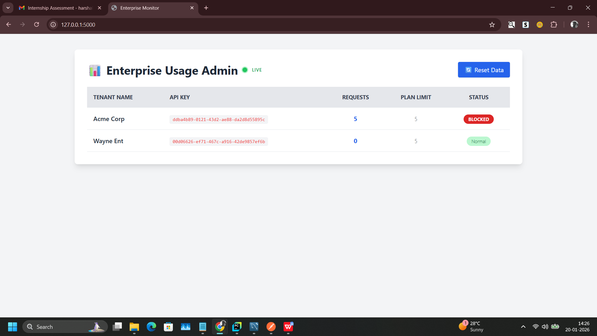

# Enterprise Usage Monitoring & Admin Platform



> A Multi-Tenant SaaS Monitoring System built with Flask, MySQL, and Tailwind CSS.
> Features **Real-Time Usage Tracking**, **Rate Limiting (Blocking)**, and an **Interactive Admin Dashboard**.

---

## 🚀 Key Features
* **Real-Time Monitoring:** Uses JavaScript polling to update usage stats every 2 seconds without page refreshes.
* **Active Rate Limiting:** Automatically blocks tenants with a `429 Too Many Requests` error if they exceed their plan limit.
* **Tenant Authentication:** Secure access using unique `X-API-KEY` headers for each enterprise client.
* **Performance Tracking:** Measures and logs API latency (response time) for every request.
* **Data Persistence:** Uses MySQL to ensure relational data integrity between Tenants, Users, and Logs.

---

## 🧠 Assumptions Made
* **Authentication:** I assumed that clients will pass the API Key via the header `X-API-KEY`.
* **Tenant Isolation:** I assumed all tenants share the same database tables but are logically separated by `tenant_id` (Shared Database, Shared Schema approach).
* **Usage Limits:** For demonstration purposes, the limit is set globally in the code (e.g., 1000 requests) rather than per-tenant in the database, though the schema supports adding a `limit` column to the `Tenant` table in the future.
* **Concurrency:** The system assumes a standard WSGI deployment; for extremely high traffic, the logging mechanism would ideally be offloaded to a queue (Redis/Celery).

---

## 📊 Data Modeling Approach
The system uses a **Normalized Relational Schema** in MySQL:

1.  **Tenants (Parent):** Represents the enterprise clients.
    * Fields: `id`, `name`, `api_key` (Unique Index).
2.  **Users (Child):** Represents the end-users belonging to a tenant.
    * Fields: `id`, `username`, `tenant_id` (Foreign Key).
3.  **UsageLogs (Audit Trail):** Stores individual API hits.
    * Fields: `id`, `tenant_id` (FK), `endpoint`, `response_time_ms`, `timestamp`.

---

## 🧪 How Dummy Data is Used
To facilitate immediate testing and demonstration without manual data entry:
* I created a dedicated setup route: **`/setup`**.
* **Tenant Generation:** It automatically creates two diverse tenants ("Acme Corp" and "Wayne Ent") with valid UUID API Keys.
* **Traffic Simulation:** (Optional in code) It can generate historical usage logs to populate the dashboard immediately, so the Admin doesn't see an empty screen upon first launch.

---

## 🔌 API Structure

### 1. Get Users (Protected Route)
Fetches the list of active users for the tenant.
* **Endpoint:** `GET /api/v1/users`
* **Headers:** `X-API-KEY: <Your_Tenant_Key>`
* **Response (Success):** Returns JSON list of users.
* **Response (Blocked):** Returns `429 Plan Limit Exceeded` error.

### 2. Live Dashboard Data
Internal API used by the frontend JavaScript engine.
* **Endpoint:** `GET /api/dashboard-data`
* **Response:** Returns real-time usage counts and status flags (Normal/Blocked) for the dashboard.

---

## 🔮 Future Improvements
* **Visual Analytics:** Integrate Chart.js to show usage trends over time (e.g., "Requests per Hour").
* **Asynchronous Logging:** Offload the database writes to a background worker (Celery + Redis) to reduce API latency.
* **Role-Based Access:** Add separate login portals for "Super Admin" vs "Tenant Admin".
* **Dynamic Limits:** Move the rate limit configuration to the Database so each tenant can have a different tier (e.g., Basic vs Pro).

---

## 💻 How to Run Locally

### Prerequisites
* Python 3.x
* MySQL Server

### Installation Steps
1.  **Clone & Install:**
    ```bash
    git clone [https://github.com/Harzh-k/enterprise-usage-monitor.git](https://github.com/Harzh-k/enterprise-usage-monitor.git)
    cd enterprise-usage-monitor
    pip install -r requirements.txt
    ```

2.  **Database Config:**
    Update `config.py` with your MySQL credentials.

3.  **Run:**
    ```bash
    python run.py
    ```
    Access at `http://127.0.0.1:5000/`.